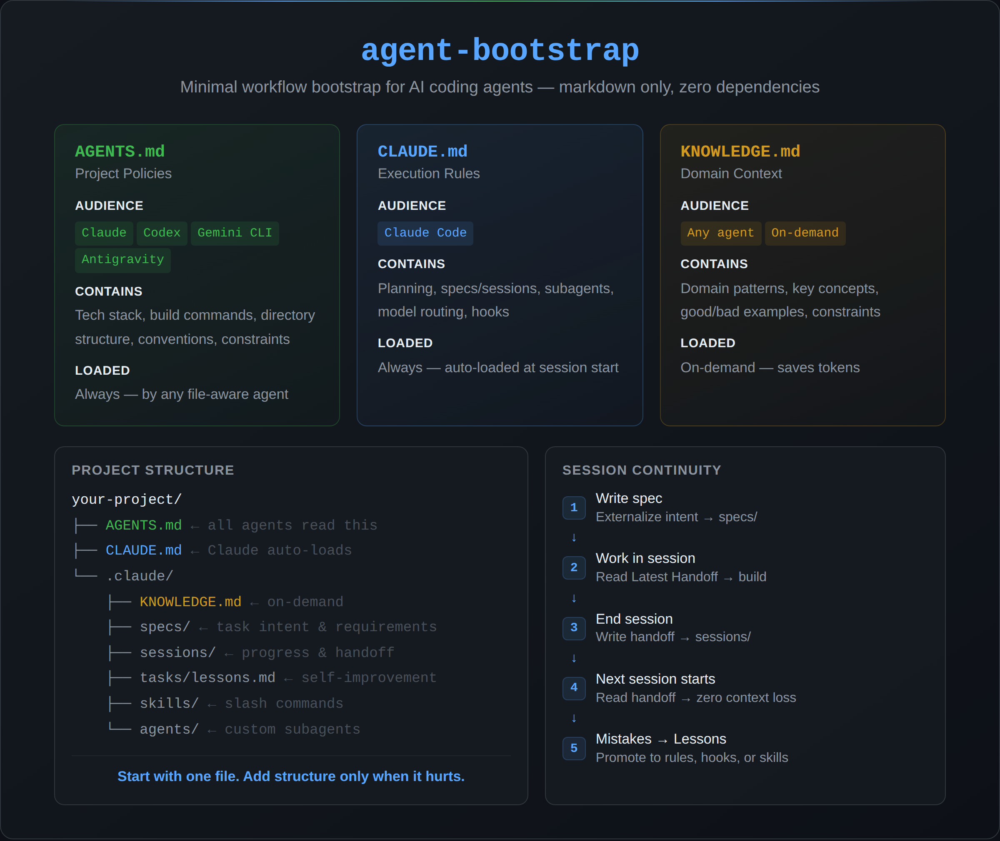

# agent-bootstrap

A minimal workflow bootstrap for AI coding agents.

> Optimized for Claude Code, portable to Codex, Gemini CLI, Antigravity, and other file-aware agents.



## Who Is This For?

**Primary:** Claude Code users who keep losing context between sessions — developers, researchers, non-developer power users.

**Secondary:** Teams running multiple agents (Claude + Codex, Gemini CLI + Antigravity, etc.) who need a single source of truth that any agent can read.

**Portable to:** Codex, Gemini CLI, Antigravity, and any agent that reads markdown files.

> If 100-agent frameworks feel like overkill, this is your starting point.

## Quick Start

### 1. Copy files to your project

```bash
git clone https://github.com/yongkyung-oh/agent-bootstrap.git
cd your-project
cp /path/to/agent-bootstrap/{AGENTS.md,CLAUDE.md,KNOWLEDGE.md,_BOOTSTRAP_GUIDE.md} .
cp -r /path/to/agent-bootstrap/.claude .claude
```

### 2. Bootstrap your project

**Claude Code (recommended):**

```
> /init
```

This runs the built-in skill that analyzes your project and fills in all templates automatically.

**Other agents (or if `/init` doesn't work):**

Paste this prompt into your agent:

```
Read @_BOOTSTRAP_GUIDE.md and @AGENTS.md.
Analyze this project and fill in all placeholders in AGENTS.md:
- Project name, description, tech stack
- Build/test/lint commands
- Directory structure
- Code conventions
Then set up .claude/ directories (specs, sessions, tasks) if missing.
Move KNOWLEDGE.md to .claude/KNOWLEDGE.md.
Move _BOOTSTRAP_GUIDE.md to .claude/_BOOTSTRAP_GUIDE.md.
Print a summary of what was configured.
```

## What You Get

```
your-project/
├── AGENTS.md              ← Project policies (all agents read this)
├── CLAUDE.md              ← Claude Code execution rules (auto-loaded)
└── .claude/
    ├── _BOOTSTRAP_GUIDE.md ← Reference documentation (moved after bootstrap)
    ├── KNOWLEDGE.md       ← Domain knowledge (loaded on-demand)
    ├── skills/            ← Skills and slash commands
    ├── specs/             ← Task specifications with index
    ├── sessions/          ← Session records with handoff
    ├── tasks/lessons.md   ← Correction tracking with promotion path
    └── agents/            ← Custom subagents (optional)
```

### Claude-Specific vs Portable

| Layer | Files | Read by |
|-------|-------|---------|
| **Portable** (agent-agnostic) | AGENTS.md, KNOWLEDGE.md, specs/, sessions/, tasks/lessons.md | Any file-aware agent |
| **Claude-specific** | CLAUDE.md, .claude/skills/, .claude/settings.json (hooks) | Claude Code only |

**AGENTS.md** contains project-level policies any agent can follow — tech stack, commands, conventions, constraints.
**CLAUDE.md** is auto-loaded by Claude Code at session start. It defines Claude-specific execution rules (planning, specs/sessions, model routing) and references AGENTS.md for project context.

## Three-Document Architecture

Everything in one file causes two problems: other agents can't read Claude-specific rules, and loading domain knowledge every session wastes tokens.

```
CLAUDE.md    → Claude behavior layer (execution rules)
AGENTS.md    → Project-level policies (agent-agnostic)
KNOWLEDGE.md → Domain context (loaded on-demand)
```

| | AGENTS.md | CLAUDE.md | KNOWLEDGE.md |
|---|---|---|---|
| **What** | Project policies | Claude execution rules | Domain knowledge |
| **Who reads it** | Any file-aware agent | Claude Code only | Any agent (on-demand) |
| **Where** | Project root | Project root | .claude/ |
| **When loaded** | Always | Always (Claude) | When relevant |

## Incremental Adoption

Not every project needs the full set. Start small, add when it hurts.

```
Step 1: AGENTS.md only — start working
         ↓ when sessions exceed 3
Step 2: Add specs/ and sessions/ — session continuity
         ↓ when the same mistakes repeat
Step 3: Add KNOWLEDGE.md + skills/ — domain knowledge
```

**More files = more context tokens per session.** Rules must earn their keep. If a rule doesn't prevent mistakes, delete it.

## Key Features

**Specs & Sessions** — The biggest cost of AI coding agents is context loss between sessions. Specs externalize intent (what & why), Sessions externalize progress (when & how). The Latest Handoff block in `sessions/README.md` is the first thing your agent reads when a session starts.

**Lesson Promotion** — Corrections start in `tasks/lessons.md`. When patterns stabilize, they promote to AGENTS.md (project rules), KNOWLEDGE.md (domain knowledge), or Hooks (deterministic enforcement). Temporary lessons that no longer apply get deleted.

**Model Routing** — Planning and architecture decisions use reasoning-heavy models. Implementation and testing use fast models. The spec template includes a model strategy section.

## Philosophy

- **Markdown only** — No scripts, no JSON configs to break across versions. Just `.md` files that Claude reads natively and other agents can follow.
- **Pointers > Copy** — Don't paste code in AGENTS.md. Use `@path/to/file` references.
- **Never send an LLM to do a linter's job** — Style enforcement belongs in tooling guards (hooks), not in prompts.
- **Honest about its limits** — This is overkill for 1-2 session projects. We tell you that upfront.

## Advanced: Hooks (Optional)

Hooks run deterministic shell commands on tool events (auto-lint, auto-format, path blocking). They are **not required** for basic usage.

> **Note:** Hooks are agent-version dependent, require `jq` installed, and may need shell configuration. Your project works fully without them.

See [_BOOTSTRAP_GUIDE.md](_BOOTSTRAP_GUIDE.md#advanced-hooks-optional) for JS/TS and Python examples.

## Documentation

See [_BOOTSTRAP_GUIDE.md](_BOOTSTRAP_GUIDE.md) for full documentation:

- Three-document architecture and design rationale
- Specs & Sessions workflow with full flow diagram
- Lesson promotion paths
- Custom skills, agents, and multi-project structure
- Settings files guide (team vs personal)
- Hooks setup examples (Advanced)

## What's in the Box

| File | Purpose |
|------|---------|
| `AGENTS.md` | Universal agent instructions template — all AI agents read this |
| `CLAUDE.md` | Claude Code execution rules: planning, subagents, specs/sessions, model routing |
| `KNOWLEDGE.md` | Domain knowledge guide and template |
| `_BOOTSTRAP_GUIDE.md` | Complete reference documentation (moves to `.claude/` after bootstrap) |
| `.claude/skills/init/` | `/init` skill for Claude Code (optional convenience) |
| `.claude/skills/_template/` | Skill template with YAML frontmatter |
| `.claude/specs/` | Spec template + index with scaling guidelines |
| `.claude/sessions/` | Session template + Latest Handoff index |
| `.claude/tasks/lessons.md` | Correction tracking with promotion path |
| `.claude/agents/_template.md` | Custom subagent template with frontmatter |

## Acknowledgments

The workflow orchestration rules in CLAUDE.md (planning, subagents, self-improvement loop, verification) were inspired by community-synthesized best practices from [Boris Cherny's Claude Code workflow thread](https://x.com/bcherny/status/2007179832300581177). The "never send an LLM to do a linter's job" and "pointers over copy" principles are from [Writing a Good CLAUDE.md](https://www.humanlayer.dev/blog/writing-a-good-claude-md) by HumanLayer. The three-document architecture and specs/sessions system are original to this project.

## References

**Claude Code Official**
- [Claude Code Docs](https://code.claude.com/docs/en/overview) — overview, architecture, and feature index
- [Memory & CLAUDE.md](https://code.claude.com/docs/en/memory) — file hierarchy, @imports, .claude/rules/, CLAUDE.local.md
- [Hooks Guide](https://code.claude.com/docs/en/hooks-guide) — setup tutorial with copy-paste examples
- [Hooks Reference](https://code.claude.com/docs/en/hooks) — all 12 events, JSON schema, matchers, exit codes
- [Skills](https://code.claude.com/docs/en/skills) — SKILL.md frontmatter, context:fork, $ARGUMENTS
- [Subagents](https://code.claude.com/docs/en/sub-agents) — .claude/agents/ format, tools, permissionMode
- [Settings](https://code.claude.com/docs/en/settings) — settings.json schema, scopes, permissions
- [Best Practices](https://code.claude.com/docs/en/best-practices) — CLAUDE.md tips, subagent patterns, context management

**Standards & Guides**
- [AGENTS.md Standard](https://github.com/agentsmd/agents.md) — universal agent instructions format (60k+ repos)
- [Writing a Good CLAUDE.md](https://www.humanlayer.dev/blog/writing-a-good-claude-md) — context engineering best practices
- [Claude Code Best Practices (community)](https://rosmur.github.io/claudecode-best-practices/) — aggregated patterns from r/ClaudeAI and practitioner blogs
- [Boris Cherny's Claude Code Workflow](https://x.com/bcherny/status/2007179832300581177) — workflow practices from the creator of Claude Code

**Community & Tools**
- [awesome-claude-code](https://github.com/hesreallyhim/awesome-claude-code) — curated skills, hooks, commands, and learning resources
- [claude-code-hooks-mastery](https://github.com/disler/claude-code-hooks-mastery) — full hook event implementation with examples
- [everything-claude-code](https://github.com/affaan-m/everything-claude-code) — comprehensive config collection (agents, skills, hooks, MCPs)
- [cclint](https://github.com/carlrannaberg/cclint) — CLAUDE.md linter
- [Claude Code Changelog](https://code.claude.com/docs/en/changelog) — track breaking changes to hooks, skills, settings

---

> Last verified: 2026-02 | Optimized for Claude Code, portable to Codex, Gemini CLI, Antigravity, and other file-aware agents.

## License

[MIT](LICENSE)
